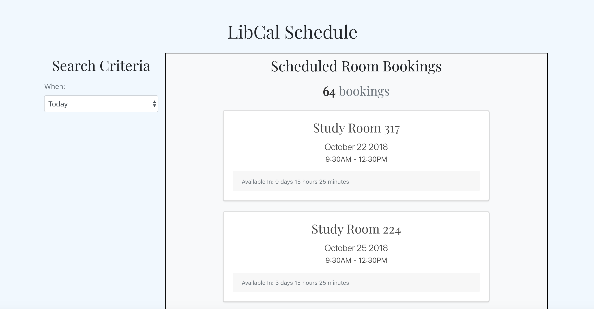

# Table List

## Web Application for viewing library room bookings

Scrapes the University of Washington LibCal website for all bookings in **Odegaard Undergraduate Library** reserved by our fraternity.

Runs a _case-insensitive_ check for all rooms booked under the name "paphi" and populates a **SQLite** database.

Using **React**, **Redux**, and **AJAX**, displays a list of library reservations, utilizing the **Django** and the **Django REST Framework** to serve this reservation data. The application is hosted on a **DigitalOcean** server.

